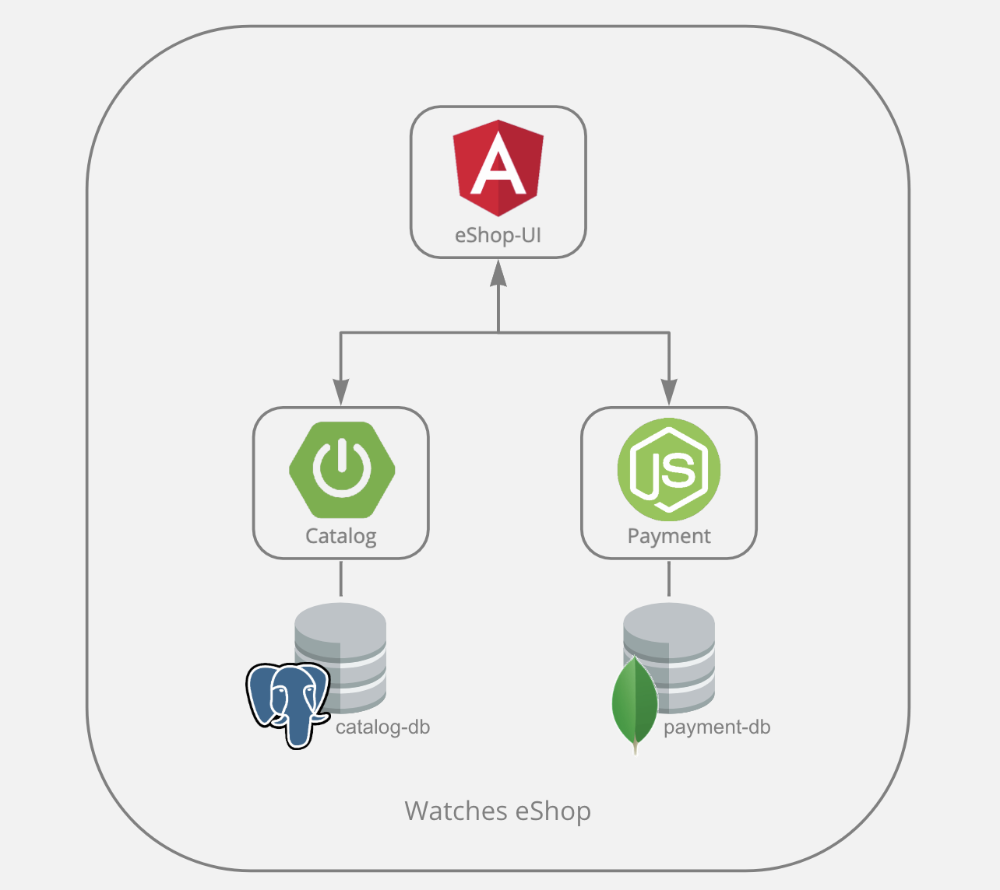

# watches-eshop-source

## Application Diagram



## Components
- [Catalog](catalog/README.md)
- [eShop User Interface](eshop-ui/README.md)
- [Payment](payment/README.md)
- [Order](order/README.md)

## OpenShift Deployment

- Create project and configure 

```sh
# Create project
oc new-project watches-eshop

```

- Deploy Catalog
```sh
# Postgresql
oc new-app postgresql-persistent \
  --param DATABASE_SERVICE_NAME=catalog-db \
  --param POSTGRESQL_USER=user \
  --param POSTGRESQL_PASSWORD=pass \
  --param POSTGRESQL_DATABASE=catalog-db \
  -n watches-eshop

# Postgresql Labels
oc label dc catalog-db \
  app.kubernetes.io/part-of=watches-eshop \
  app.openshift.io/runtime=postgresql \
  -n watches-eshop

# Catalog
oc new-app --name=catalog \
  https://github.com/clbartolome/watches-eshop-source --context-dir=catalog \
  -i ubi8-openjdk-11:1.3 \
  -e DB_HOST=catalog-db \
  -e DB_PORT=5432 \
  -e DB_NAME=catalog-db \
  -e DB_USER=user \
  -e DB_PASS=pass \
  -n watches-eshop

# Expose service
oc expose svc catalog


# Catalog Labels
oc label deploy catalog \
  app.kubernetes.io/part-of=watches-eshop \
  app.openshift.io/runtime=spring-boot \
  -n watches-eshop

# Catalog Annotations
oc annotate deploy catalog app.openshift.io/connects-to='[{"apiVersion":"apps.openshift.io/v1","kind":"DeploymentConfig","name":"catalog-db"}]' -n watches-eshop

# Validate
curl http://catalog-watches-eshop.{cluster-domain}/watches | jq
```

- Deploy Order
```sh
# Postgresql
oc new-app postgresql-persistent \
  --param DATABASE_SERVICE_NAME=order-db \
  --param POSTGRESQL_USER=user \
  --param POSTGRESQL_PASSWORD=pass \
  --param POSTGRESQL_DATABASE=order-db \
  -n watches-eshop

# Postgresql Labels
oc label dc order-db \
  app.kubernetes.io/part-of=watches-eshop \
  app.openshift.io/runtime=postgresql \
  -n watches-eshop

oc new-app --name=order \
  openshift/ubi8-openjdk-11:1.3~https://github.com/clbartolome/watches-eshop-source#feature/openshift_deployment --context-dir=order \
  -e DB_HOST=order-db \
  -e DB_PORT=5432 \
  -e DB_NAME=order-db \
  -e DB_USER=user \
  -e DB_PASS=pass \
  -n watches-eshop

# Expose service
oc expose svc order


# Catalog Labels
oc label deploy order \
  app.kubernetes.io/part-of=watches-eshop \
  app.openshift.io/runtime=quarkus \
  -n watches-eshop

# Catalog Annotations
oc annotate deploy order app.openshift.io/connects-to='[{"apiVersion":"apps.openshift.io/v1","kind":"DeploymentConfig","name":"order-db"}]' -n watches-eshop

# Validate
curl http://order-watches-eshop.{cluster-domain}/orders | jq
```

- Deploy Pay
```sh
# MongoDB
oc new-app --docker-image=mongo:latest \
  -e MONGO_INITDB_ROOT_USERNAME=admin \
  -e MONGO_INITDB_ROOT_PASSWORD=pass \
  --name payment-db \
  -n watches-eshop

# MongoDB Labels
oc label deploy payment-db \
  app.kubernetes.io/part-of=watches-eshop \
  app.openshift.io/runtime=mongodb \
  -n watches-eshop

oc new-app --name=payment \
  openshift/nodejs:12-ubi8~https://github.com/clbartolome/watches-eshop-source#feature/openshift_deployment --context-dir=payment \
  -e PORT=8080 \
  -e DB_HOST=payment-db \
  -e DB_PORT=27017 \
  -e DB_NAME=payment-db \
  -e DB_USER=admin \
  -e DB_PASS=pass \
  -n watches-eshop

# Expose service
oc expose svc payment


# Catalog Labels
oc label deploy payment \
  app.kubernetes.io/part-of=watches-eshop \
  app.openshift.io/runtime=nodejs \
  -n watches-eshop

# Catalog Annotations
oc annotate deploy payment app.openshift.io/connects-to='[{"apiVersion":"apps/v1","kind":"Deployment","name":"payment-db"}]' -n watches-eshop

# Validate
curl http://order-watches-eshop.{cluster-domain}/payments | jq
```

- Deploy UI:
```sh
# Build source
cd eshop-ui
ng build

# Buil and Deploy
oc new-app --strategy=docker --binary --name eshop-ui

oc start-build eshop-ui --from-dir .

# Create and expose service
cat <<EOF | oc apply -n watches-eshop -f -
apiVersion: v1
kind: Service
metadata:
  labels:
    app: eshop-ui
    app.kubernetes.io/component: eshop-ui
    app.kubernetes.io/instance: eshop-ui
  name: eshop-ui
spec:
  internalTrafficPolicy: Cluster
  ports:
  - name: 8080-tcp
    port: 8080
    protocol: TCP
    targetPort: 8080
  selector:
    deployment: eshop-ui
  type: ClusterIP
EOF

oc expose svc eshop-ui

# UI Labels
oc label deploy eshop-ui \
  app.kubernetes.io/part-of=watches-eshop \
  app.openshift.io/runtime=nginx \
  -n watches-eshop

oc annotate deploy eshop-ui app.openshift.io/connects-to='[{"apiVersion":"apps/v1","kind":"Deployment","name":"order"},{"apiVersion":"apps/v1","kind":"Deployment","name":"catalog"},{"apiVersion":"apps/v1","kind":"Deployment","name":"payment"}]' -n watches-eshop

# Setup configuration (!! UPDATE URLS)
cat <<'EOF' >> config.json
{
  "watchUrl": "http://catalog-watches-eshop.apps.cluster-dsn85.dsn85.sandbox1459.opentlc.com",
  "watchPath": "/watches",
  "paymentUrl": "payment-watches-eshop.apps.cluster-dsn85.dsn85.sandbox1459.opentlc.com",
  "paymentPath": "/payments",
  "orderUrl": "order-watches-eshop.apps.cluster-dsn85.dsn85.sandbox1459.opentlc.com",
  "orderPath": "/orders"
}
EOF

oc create configmap eshop-config --from-file=config.json -n watches-eshop

oc set volume deploy/eshop-ui --add --type=configmap --configmap-name=eshop-config --mount-path=/usr/share/nginx/html/assets/config -n watches-eshop

```


